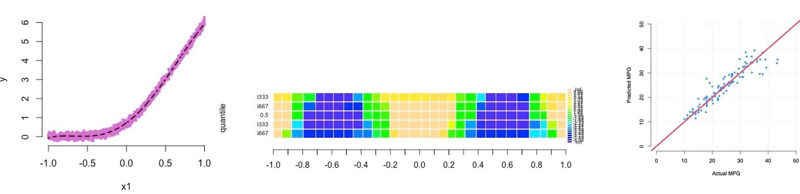

# AutomatedModelBuilding

This repository contains code and data used in the paper *Automated Model Building and Goodness-of-fit via Quantile Regression* by Bar, Booth, and Wells (in preparation).

In order to run the code you must first install the QREM package. Since QREM has a model selection option for cases in which the number of predictors is large you also need to install the packages edgefinder and SEMMS:

```
devtools::install_github("haimbar/edgefinder")
devtools::install_github("haimbar/SEMMS")
devtools::install_github("haimbar/QREM")
```

See more detailed documentation in the [pdf file](https://github.com/haimbar/AutomatedModelBuilding/blob/main/ModelBuilding.pdf) in the [repository's main folder](https://github.com/haimbar/AutomatedModelBuilding).

<CENTER>
    
</CENTER>
